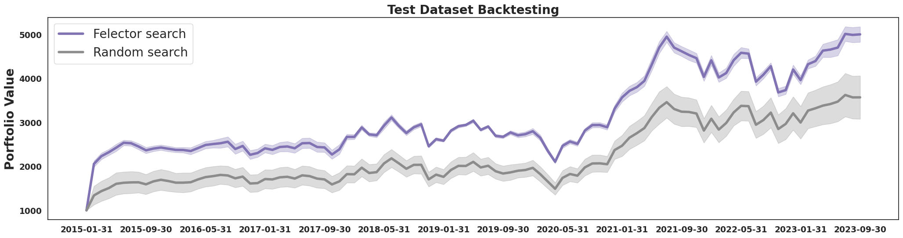
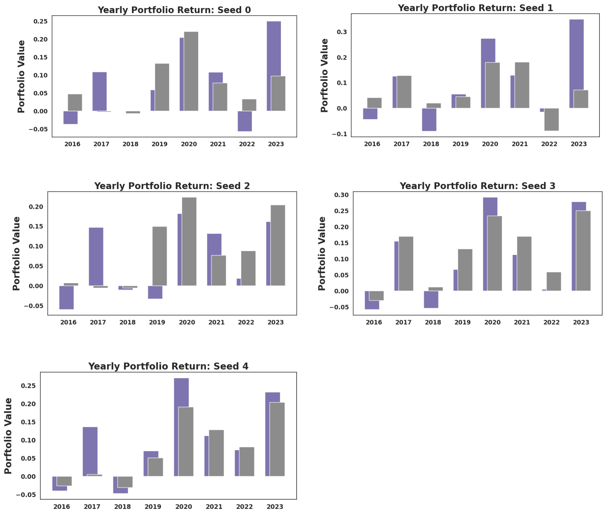

# Felector: Factor Selection Algorihtm
- **팩터 부분집합 선택  문제**를 풀기 위한 RL 알고리즘. ***Felector*** 구현
- 각 팩터 점수에 줄 수 있는 가중치를 최적화하도록 강화학습
- 결과적으로 다음 전략이 가장 높은 CAPM alpha, Sharpe ratio, MDD를 가짐  
*12M*: **19%**, *12M-3M*: **58%**, *K-RATI*O: **23%** 

# Overview

***코드 실행***

    python main.py --algorithm RL # Run Felector algorithm
    python main.py --algorithm random # Run random search

***모듈 설명***
- FactorManager: 팩터 값 데이터에서 스코어 및 랭킹 데이터 추출
- BackTester: 팩터 랭킹 데이터로부터 포트폴리오 구성 후 백테스팅 진행
- Agent: 탐색 알고리즘 (Felector, Random)의 탐색 및 파라미터 업데이트 

***탐색 팩터 공간***
- 1개월, 3개월 6개월, 9개월, 12개월 주가 수익률 모멘텀 
- 12개월 모멘텀 - 1개월 모멘텀, 
- 12개월 모멘텀 - 3개월 모멘텀
- 12개월 모멘텀 - 6개월 모멘텀
- 12개월 모멘텀 - 9개월 모멘텀
- K-Ratio

***투자 유니버스***
- 코스피 보통주
- 시가총액 상위 300개

***포트폴리오 구성***
- 팩터 점수 합 랭킹 30개를 포트폴리오로 보유
- 1개월 단위로 리밸런싱
- 동일 가중 포트폴리오
